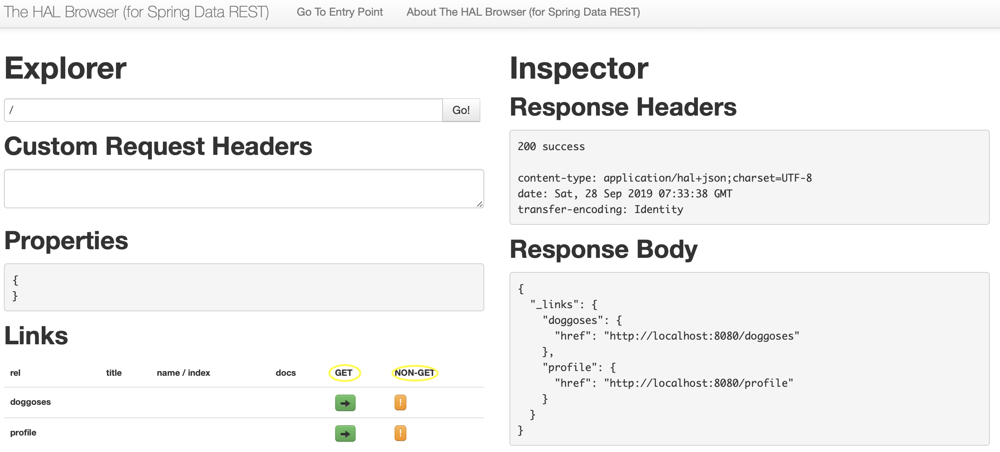
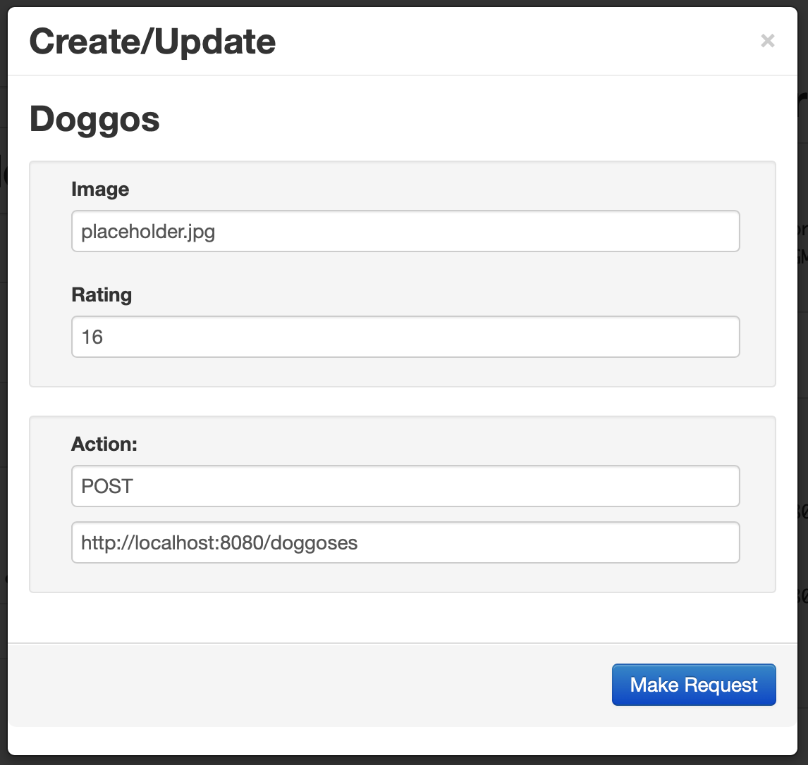
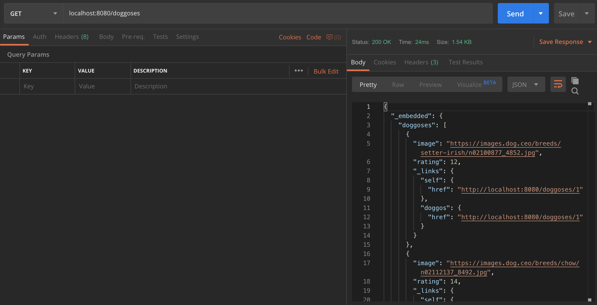
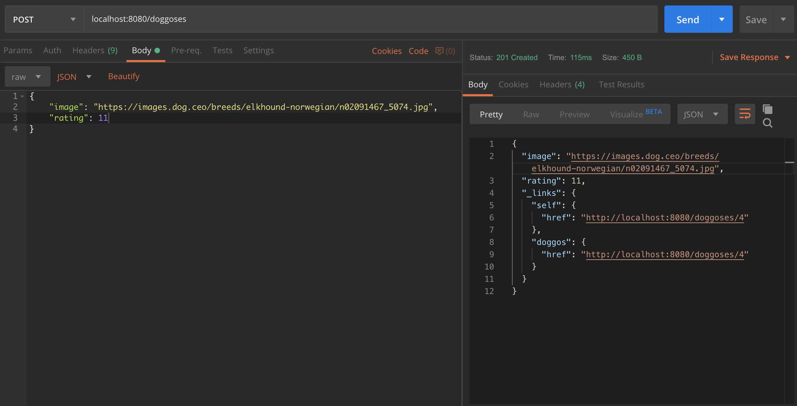

# We Rate Dogs API
[](https://build.spring.io/browse/SPR) 

Backend java web service that has exposes GET and Non-GET APIs. Generated with [Maven](https://maven.apache.org/what-is-maven.html) and the [Spring](https://spring.io) Java Framework.

## Apache Maven and Spring

Apache Maven is a software project management and comprehension tool. Based on the concept of a project object model (POM), Maven can manage a project's build, reporting and documentation from a central piece of information.

The Spring framework makes it easy to create Java enterprise applications. It provides everything you need to embrace the Java language in an enterprise environment.The framework's core features can be used by any Java application, but there are extensions for building web applications on top of the Java EE (Enterprise Edition) platform.

The use of Spring in this project, enables the use of `@RepositoryRestResource` annotation. Which takes care of customize export mapping and relations.

## Development server

Application has been tested running Tomcat server from Eclipse on *localhost:8080*. All information gets stored in memory and it will be reset whenever the server stops.

## Build

The application contains two records preloaded into mem, both can get display by hitting the GET API. Whenever the server is initialized and the app is running, a UI (index.html) is created from which CRUD functions can be requested:  



## API Requests

GET and POST requests are supported. The POST API is given a request body that has a dog image url and a numeric rating between 10-16. The GET API return all dogs that are stored on the memory of the server.

When running the GET request, the following `JSON` object is returned before posting more information *(by default)*:
```JSON
{
  "_embedded" : {
    "doggoses" : [ {
      "image" : "https://images.dog.ceo/breeds/setter-irish/n02100877_4852.jpg",
      "rating" : 12,
      "_links" : {
        "self" : {
          "href" : "http://localhost:8080/doggoses/1"
        },
        "doggos" : {
          "href" : "http://localhost:8080/doggoses/1"
        }
      }
    }, {
      "image" : "https://images.dog.ceo/breeds/chow/n02112137_8492.jpg",
      "rating" : 14,
      "_links" : {
        "self" : {
          "href" : "http://localhost:8080/doggoses/2"
        },
        "doggos" : {
          "href" : "http://localhost:8080/doggoses/2"
        }
      }
    }, {
      "image" : "https://images.dog.ceo/breeds/entlebucher/n02108000_1533.jpg",
      "rating" : 13,
      "_links" : {
        "self" : {
          "href" : "http://localhost:8080/doggoses/3"
        },
        "doggos" : {
          "href" : "http://localhost:8080/doggoses/3"
        }
      }
    } ]
  },
  "_links" : {
    "self" : {
      "href" : "http://localhost:8080/doggoses"
    },
    "profile" : {
      "href" : "http://localhost:8080/profile/doggoses"
    }
  }
}
```
POST requires two key pairs is the `body` of the request, for example:
```JSON
{
	"image": "https://images.dog.ceo/breeds/elkhound-norwegian/n02091467_5074.jpg",
	"rating": 11
}
```
This post request can be runned directly from the HAL UI `index.html` when clicking on the NON-GET request button next to the doggos relation:




## Additional Testing on Postman

Here's a couple of screenshot showing additional testing runned on the POSTMAN client:


